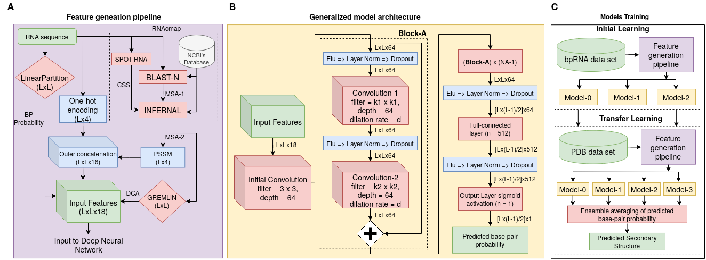
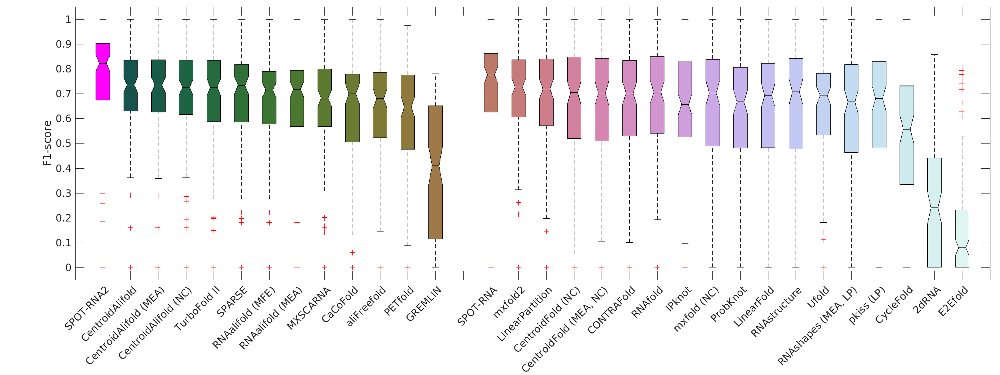

# SPOT-RNA2
Improved RNA Secondary Structure and Tertiary Base-pairing Prediction using Evolutionary Profile, Mutational Coupling and Two-dimensional Transfer Learning.

## Contents

  * [Introduction](#introduction)
  * [Results](#results)
  * [System Requirments](#system-requirments)
  * [Installation](#installation)
  * [Usage](#Usage)
  * [Datasets](#datasets)
  * [Citation guide](#citation-guide)
  * [Licence](#licence)
  * [Contact](#contact)

## Introduction

The recent discovery of numerous non-coding RNAs (long non-coding RNAs, in particular) has transformed our perception about the roles of RNAs in living organisms. Our ability to understand them, however, is hampered by our inability to solve their secondary and tertiary structures in high resolution efficiently by existing experimental techniques. Computational prediction of RNA secondary structure, on the other hand, has received much-needed improvement, recently, through deep learning of a large approximate data, followed by transfer learning with gold-standard base-pairing structures from high-resolution 3-D structures. Here, we expand this single-sequence-based learning to the use of evolutionary profiles and mutational coupling.

|
|----|
| <p align="center"> <b>Figure 1:</b> (A) Inputted one dimensional (1-D) and two dimensional (2-D) features employed in SPOT-RNA2 (L is the RNA sequence length; BP is base-pair; CSS is consensus secondary structure). (B) An example of the model architecture of SPOT-RNA2. (C) The schematic diagram for model pre-training by the bpRNA data set (TR0) and transfer learning by PDB data set (TR1).|

Results
----
The new method allows large improvement not only in canonical base-pairs (RNA secondary structures) but more so in base-pairing associated with tertiary interactions such as pseudoknots, noncanonical and lone base-pairs. In particular, it is highly accurate for those RNAs of more than 1000 homologous sequences by achieving > 0.8 F1-score (harmonic mean of sensitivity and precision) for 14/16 RNAs tested. The method can also significantly improve base-pairing prediction by incorporating artificial but functional homologous sequences generated from deep mutational scanning without any modification. The fully automatic method should provide the scientific community a new powerful tool to capture not only the secondary structure but also tertiary base-pairing information for building three-dimensional models. It also highlights the future of accurately solving the base-pairing structure by using a large number of natural and/or artificial homologous sequences.


|
|----|
| <p align="center"> <b>Figure 2:</b> Distribution of F1-scores for individual RNAs on the combined test sets TS1, TS2, and TS3 given by various methods as labeled. On each box, the central mark indicates the median, and the bottom and top edges of the box indicate the 25th and 75th percentiles, respectively. The outliers are plotted individually by using the “+” symbol.|


## System Requirments

**Hardware Requirments:**
It is recommended that your system should have 32 GB RAM, 500 GB disk space to support the in-memory operations for RNA sequence length less than 500. Multiple CPU threads are also recommended as the MSA generating process is computationally expensive.

**Software Requirments:**
* [Python3.6](https://docs.python-guide.org/starting/install3/linux/)
* [Perl-5.4 or later](https://www.perl.org/get.html)
* [virtualenv](https://virtualenv.pypa.io/en/latest/installation/) or [Anaconda](https://anaconda.org/anaconda/virtualenv)
* [CUDA 10.0](https://developer.nvidia.com/cuda-10.0-download-archive) (Optional if using GPU)
* [cuDNN (>= 7.4.1)](https://developer.nvidia.com/cudnn) (Optional if using GPU)
* [Docker](https://docs.docker.com/engine/install/) (Optional if runnig SPOT-RNA2 through docker image)

SPOT-RNA2 has been tested on Ubuntu 14.04, 16.04, and 18.04 operating systems.


## Installation

### Installation using Docker image:

The following command can be used to install SPOT-RNA2 and its dependencies:

1. `git clone https://github.com/jaswindersingh2/SPOT-RNA2.git && cd SPOT-RNA2`

2. `docker image build -t spot_rna2 .`

### Manual installation:

To install SPOT-RNA2 and its dependencies following commands can be used in the terminal:


1. `git clone https://github.com/jaswindersingh2/SPOT-RNA2.git && cd SPOT-RNA2`
2. `wget -O utils/models_ckps.tar.xz 'https://www.dropbox.com/s/udzcsva76lh5wvq/models_ckps.tar.xz' || wget -O utils/models_ckps.tar.xz 'https://app.nihaocloud.com/f/586acb2658d74ccb92b8/?dl=1'`
3. `tar -xvf utils/models_ckps.tar.xz -C utils/ && rm utils/models_ckps.tar.xz`
4. `sudo apt install cpanminus && sudo cpanm Graph && sudo apt install gawk`

Based on the virtual environment package manager (**virtualenv** or **conda**) you have follow the stpes below:<br />

|  | &nbsp;&nbsp;&nbsp;&nbsp;&nbsp;&nbsp;&nbsp;&nbsp;&nbsp;&nbsp;&nbsp;&nbsp;&nbsp;&nbsp;&nbsp;&nbsp;&nbsp;&nbsp;&nbsp;&nbsp;&nbsp; virtualenv | &nbsp;&nbsp;&nbsp;&nbsp;&nbsp;&nbsp;&nbsp;&nbsp;&nbsp;&nbsp;&nbsp;&nbsp;&nbsp;&nbsp;&nbsp;&nbsp;&nbsp;&nbsp;&nbsp;&nbsp;&nbsp;&nbsp;&nbsp;&nbsp;&nbsp;&nbsp;&nbsp;&nbsp;&nbsp;&nbsp;&nbsp;&nbsp;&nbsp;&nbsp;&nbsp;&nbsp; conda |
| :- | :-------- | :--- |
| 5. | `virtualenv -p python3.6 venv` | `conda create -n venv python=3.6` |
| 6. | `source ./venv/bin/activate` | `conda activate venv` | 
| 7. | `pip install -r requirements.txt && deactivate` | `while read p; do conda install --yes $p; done < requirements.txt && conda deactivate` | 

If you have **Infernal** already installed, please set `binaries/` directory path of **Infernal** installation in line 12 of the `run_spotrna2.sh`. Otherwise, follow commands below to install **Infernal** tool. If you run into issue, please follow the [link](http://eddylab.org/infernal/) for more info.

8. `wget 'eddylab.org/infernal/infernal-1.1.3-linux-intel-gcc.tar.gz' && tar -xvzf infernal-*.tar.gz && rm infernal-*.tar.gz`

If you have **BLASTN** already installed, please set `bin/` directory path of **BLASTN** installation in line 10 of the `run_spotrna2.sh`. Otherwise, follow commands below to install **BLASTN** tool. If you run into issue, please follow the [link](https://blast.ncbi.nlm.nih.gov/Blast.cgi?CMD=Web&PAGE_TYPE=BlastDocs&DOC_TYPE=Download) for more info.

9. `wget 'ftp://ftp.ncbi.nlm.nih.gov/blast/executables/blast+/LATEST/ncbi-blast-*+-x64-linux.tar.gz' && tar -xvzf ncbi-blast-*+-x64-linux.tar.gz && rm ncbi-blast-*+-x64-linux.tar.gz`

To install the **SPOT-RNA** predictor, follow the commands below:<br />

10. `git clone https://github.com/jaswindersingh2/SPOT-RNA.git && cd SPOT-RNA`
11. `wget 'https://www.dropbox.com/s/dsrcf460nbjqpxa/SPOT-RNA-models.tar.gz' || wget -O SPOT-RNA-models.tar.gz 'https://app.nihaocloud.com/f/fbf3315a91d542c0bdc2/?dl=1'`
12. `tar -xvzf SPOT-RNA-models.tar.gz && rm SPOT-RNA-models.tar.gz && cd ../`

To install the DCA predictor, follow the commands below:<br />

13. `git clone "https://github.com/sokrypton/GREMLIN_CPP" && cd GREMLIN_CPP && g++ -O3 -std=c++0x -o gremlin_cpp gremlin_cpp.cpp -fopenmp && cd ../`

To install the LinearPartition, follow the commands below:<br />

14. `git clone 'https://github.com/LinearFold/LinearPartition.git' && cd LinearPartition/ && make && cd ../`

If NCBI's nt database already available in your system, please set path to the database directory in line 11 and 13 of the `run_spotrna.sh` file. Otherwise, use the following command to download. It can take few hours the download to finish depending on your internet speed. If you run into issue, please follow the [link](https://blast.ncbi.nlm.nih.gov/Blast.cgi?PAGE_TYPE=BlastDocs&DOC_TYPE=Download) for more info.

15. `wget -c "ftp://ftp.ncbi.nlm.nih.gov/blast/db/FASTA/nt.gz" -O ./nt_database/nt.gz && gunzip ./nt_database/nt.gz`

Database needs to be formated for using in **BLASTN**. Please follow the command below to format the database.<br />

16. `./ncbi-blast-*+/bin/makeblastdb -in ./nt_database/nt -dbtype nucl`


## Usage

### Run SPOT-RNA2 using docker:

`docker run --rm -ti -v $(pwd)/sample_run:/SPOT-RNA2/sample_run -v $(pwd)/nt_database/:/SPOT-RNA2/nt_database spot_rna2:latest ./run_spotrna2.sh sample_run/6ufj.fasta`

### Run SPOT-RNA2 using Manual installation:
```
./run_spotrna2.sh sample_run/6ufj.fasta 
```

Both command creates two folder `6ufj_features` and `6ufj_outputs` in input file directory (`sample_run/` in this case). `6ufj_features/` contains all the alignments (MSA-1, MSA-2) and features (PSSM, DCA, bps probability) generated from SPOT-RNA2 pipeline. `6ufj_outputs/` contains predicted secondary structure in bpseq format (`6ufj.bpseq`), ct format (`6ufj.ct`), dbn format (`6ufj.st`) with secondary structure motifs, and base-pair probability (`6ufj.prob`). The verify the results, it should be same as in `sample_seq_features` and `sample_seq_outputs` folder because both sequence (`sample_seq.fasta` and `6ufj.fasta`) are same.

## Datasets

The following datasets were used for Initial Training:
* bpRNA[1]: Initial Learning (Training TR0, validation VL0, and test TS0)  
[Dropbox](https://www.dropbox.com/s/sg1p1otsqnaqev8/bpRNA_dataset.tar.xz) or [Nihao Cloud](https://app.nihaocloud.com/f/6f7b456d874c4842b8ac/)


The following datasets were used for Transfer Learning:
* PDB[2]: Transfer Learning (Training TR1, validation VL1, and testsets TS1, TS2, TS3, and TS_hard)  
[Dropbox](https://www.dropbox.com/s/apqrsl7hm1091ie/PDB_dataset.tar.xz) or [Nihao Cloud](https://app.nihaocloud.com/f/f301baed4dac4474a185/)

## Citation guide

**If you use SPOT-RNA2 for your research please cite the following papers:**

Jaswinder Singh, Kuldip Paliwal, Tongchuan Zhang, Jaspreet Singh, Thomas Litfin, Yaoqi Zhou, Improved RNA Secondary Structure and Tertiary Base-pairing Prediction Using Evolutionary Profile, Mutational Coupling and Two-dimensional Transfer Learning, Bioinformatics, 2021;, btab165, https://doi.org/10.1093/bioinformatics/btab165

**If you use SPOT-RNA2 data sets and/or input feature pipeline, please consider citing the following papers:**

[1] Zhang, T., Singh, J., Litfin, T., Zhan, J., Paliwal, K. and Zhou, Y., 2020. RNAcmap: A Fully Automatic Method for Predicting Contact Maps of RNAs by Evolutionary Coupling Analysis. bioRxiv.

[2] Zhang, H., Zhang, L., Mathews, D.H. and Huang, L., 2020. LinearPartition: linear-time approximation of RNA folding partition function and base-pairing probabilities. Bioinformatics, 36(Supplement_1), pp.i258-i267.

[3] Singh, J., Hanson, J., Paliwal, K. and Zhou, Y., 2019. RNA secondary structure prediction using an ensemble of two-dimensional deep neural networks and transfer learning. Nature communications, 10(1), pp.1-13.

[4] Nawrocki, E.P. and Eddy, S.R., 2013. Infernal 1.1: 100-fold faster RNA homology searches. Bioinformatics, 29(22), pp.2933-2935.

[5] H.M. Berman, J. Westbrook, Z. Feng, G. Gilliland, T.N. Bhat, H. Weissig, I.N. Shindyalov, P.E. Bourne. (2000) The Protein Data Bank Nucleic Acids Research, 28: 235-242.

[6] Padideh Danaee, Mason Rouches, Michelle Wiley, Dezhong Deng, Liang Huang, David Hendrix, bpRNA: large-scale automated annotation and analysis of RNA secondary structure, Nucleic Acids Research, Volume 46, Issue 11, 20 June 2018, Pages 5381–5394, https://doi.org/10.1093/nar/gky285

[7] Kamisetty, H., Ovchinnikov, S. and Baker, D., 2013. Assessing the utility of coevolution-based residue–residue contact predictions in a sequence-and structure-rich era. Proceedings of the National Academy of Sciences, 110(39), pp.15674-15679.

[8] Chiu, J.K.H. and Chen, Y.P.P., 2014. Efficient conversion of RNA pseudoknots to knot-free structures using a graphical model. IEEE Transactions on Biomedical Engineering, 62(5), pp.1265-1271.

Licence
-----
Mozilla Public License 2.0


Contact
-----
jaswinder.singh3@griffithuni.edu.au, yaoqi.zhou@griffith.edu.au
